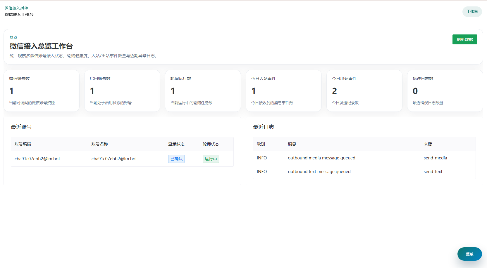
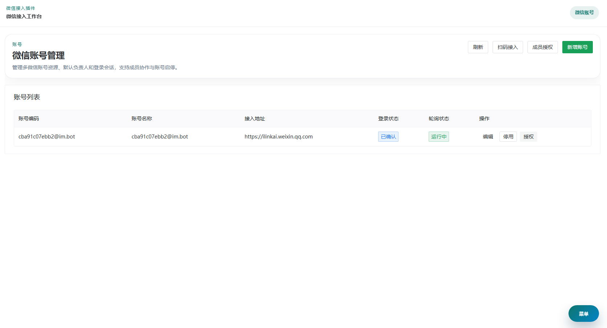
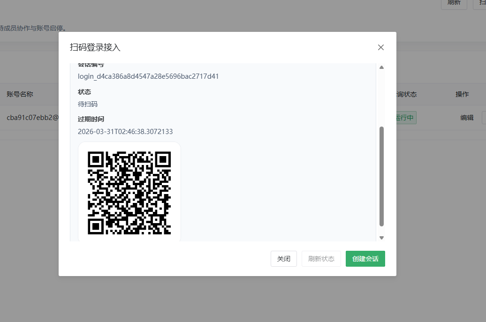
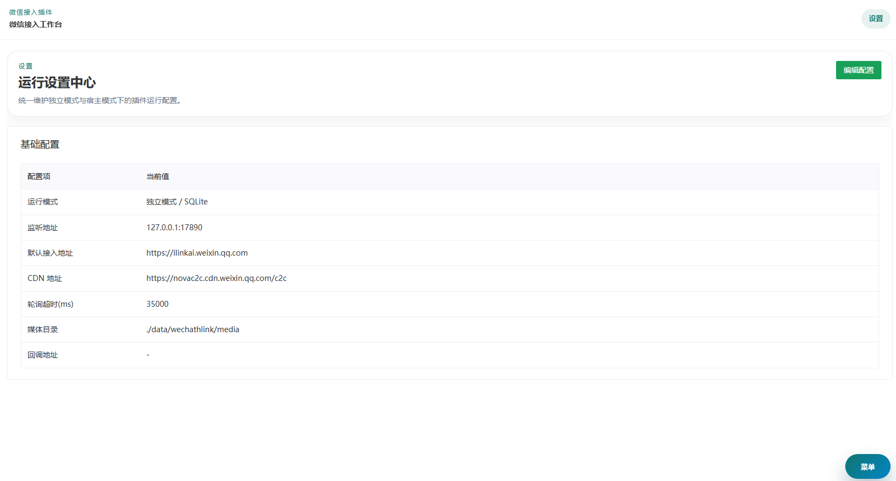
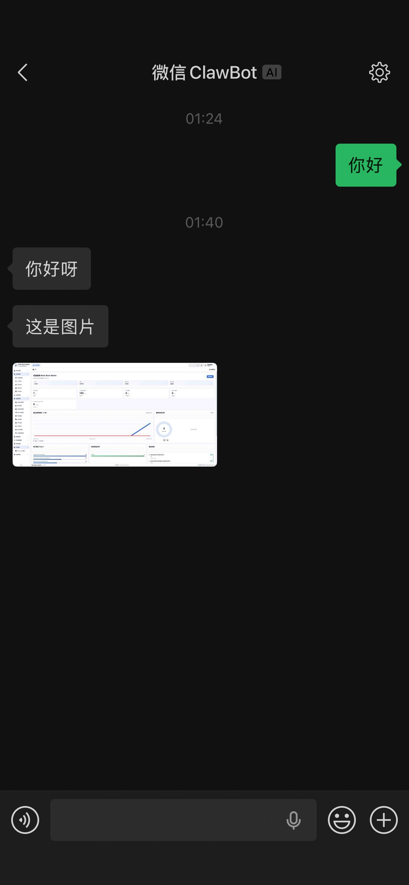

# Wechat HLink Plugins

[](https://adoptium.net/)
[](https://spring.io/projects/spring-boot)
[](https://vuejs.org/)
[](https://github.com/v18268185209/ilinkbot-plugins/blob/main/LICENSE)
[](https://github.com/v18268185209/ilinkbot-plugins/stargazers)

让微信接入更简单，让插件部署更轻量。

`Wechat HLink Plugins` 是面向 `brick-bootkit-admin` 生态的微信接入插件，聚焦微信账号接入、扫码登录、事件查看、消息发送和运行配置等核心能力。

它既可以作为 `brick-bootkit-admin` 插件运行，也可以作为独立的 Spring Boot 应用启动，适合需要统一管理多个微信接入账号的场景。

如果你正在寻找一个更容易落地、同时兼顾插件化集成和独立部署能力的微信接入方案，这个项目正是为这类场景准备的。

核心能力：

- 账号接入
- 扫码登录
- 事件追踪
- 消息发送
- 配置管理

快速入口：

- [快速开始](#快速开始)
- [界面预览](#界面预览)
- [适用模式](#适用模式)
- [配置说明](#配置说明)
- [Star 支持项目](https://github.com/v18268185209/ilinkbot-plugins/stargazers)

> 如果这个项目帮你节省了接入、联调或部署时间，欢迎给仓库点一个 `Star`。你的支持会直接帮助项目持续迭代。

## 项目亮点

- 开箱即用，覆盖账号接入、登录、事件、发送、设置等核心能力
- 双模式部署，同时支持宿主插件模式和独立运行模式
- 面向多账号协作场景，适合统一管理、权限隔离和持续扩展
- 前后端分层清晰，既适合直接使用，也适合二次开发

## 功能简介

- 微信账号接入与状态管理
- 扫码登录与登录会话查询
- 多账号轮询与运行状态展示
- 入站、出站事件查询
- 文本、图片、视频、文件、语音消息发送
- 运行参数与基础配置管理
- 宿主模式下的账号授权与数据权限隔离

## 适用模式

### 1. 宿主模式

- 作为 `brick-bootkit-admin` 插件加载
- 复用宿主系统账号体系
- 自动使用宿主 MySQL 数据源派生 `wechathlink` schema
- 前端页面以微应用方式挂载到宿主系统

### 2. 独立模式

- 作为 Spring Boot 应用单独启动
- 默认使用 SQLite
- 适合本地试用、轻量部署或独立运行

## 运行环境

- JDK 17
- Maven 3.9+
- Node.js 18+ 与 npm
- MySQL 8

说明：

- 独立模式默认使用 SQLite，不强制依赖 MySQL
- 如果从源码构建，需要先安装前端依赖

## 快速开始

### 1. 从源码构建

先安装前端依赖：

```powershell
cd sources
npm install
```

回到项目根目录执行打包：

```powershell
mvn clean package
```

打包完成后，产物位于 `target/` 目录。

### 2. 独立模式启动

可以使用打包后的 jar 启动，例如：

```powershell
java -jar target/wechat-hlink-plugins-0.0.1.jar
```

启动后可以访问当前服务地址下的页面，例如：

- `/`
- `/overview`
- `/accounts`
- `/events`
- `/messages`
- `/settings`

默认情况下：

- SQLite 文件路径为 `./data/wechathlink.db`
- 媒体目录为 `./data/wechathlink/media`

### 3. 作为 `brick-bootkit-admin` 插件部署

先执行：

```powershell
mvn clean package
```

然后将生成的插件包按宿主系统的插件安装方式导入或部署。

在宿主模式下，插件启动后会自动完成以下工作：

- 初始化 `wechathlink` 数据库结构
- 同步前端静态资源到宿主微应用目录
- 注册或更新微应用信息

默认微应用名称为：

- 中文名：`微信接入`
- 标识名：`wechatHlinkPlugins`

## 主要页面

- 工作台：查看账号数量、在线状态、轮询健康度和最近日志
- 微信账号：新增接入账号、查看状态、启停、重新连接和授权管理
- 登录会话：创建扫码登录会话并查询登录状态
- 事件中心：按账号、方向、类型分页查看事件
- 消息发送：选择账号后发送文本或媒体消息
- 设置中心：维护运行参数、基础地址、轮询超时和媒体目录

## 界面预览

### 1. 工作台



用于集中查看账号概览、轮询状态和最近运行信息，适合快速掌握当前接入情况。

### 2. 微信账号管理



用于维护接入账号、查看在线状态，并完成启停、重连和授权等日常管理操作。

### 3. 事件中心



用于按账号、方向和类型查看事件记录，帮助排查消息流转、登录状态和业务异常。

### 4. 消息发送台



支持按账号选择发送目标，完成文本和媒体消息下发，适合联调、测试和运营场景。

### 5. 设置中心



用于集中维护运行参数、基础地址、轮询超时和媒体目录等关键配置，便于部署后统一管理。

## 配置说明

主要配置文件：

- `src/main/resources/wechathlink-application.yaml`
- `src/main/resources/wechathlink-application-local.yaml`

说明：

- 当前配置项前缀仍然沿用 `eqadmin.wechathlink` 命名，这是现有实现中的兼容命名方式

常用配置项如下：

| 配置项 | 说明 | 默认值 |
| --- | --- | --- |
| `eqadmin.wechathlink.datasource.mode` | 数据源模式，自动识别宿主或强制独立模式 | `auto` |
| `eqadmin.wechathlink.datasource.sqlite.path` | SQLite 文件路径 | `./data/wechathlink.db` |
| `eqadmin.wechathlink.runtime.default-base-url` | iLink 默认服务地址 | `https://ilinkai.weixin.qq.com` |
| `eqadmin.wechathlink.runtime.cdn-base-url` | 媒体 CDN 地址 | `https://novac2c.cdn.weixin.qq.com/c2c` |
| `eqadmin.wechathlink.runtime.poll-timeout-ms` | 轮询超时时间 | `35000` |
| `eqadmin.wechathlink.runtime.media-dir` | 媒体文件保存目录 | `./data/wechathlink/media` |
| `eqadmin.wechathlink.runtime.webhook-url` | Webhook 回调地址 | 空 |
| `eqadmin.wechathlink.startup.microapp-base-url` | 宿主模式微应用访问路径 | `/childrens/wechathlink/` |

补充说明：

- 独立模式下会自动加载 `wechathlink-application-local.yaml`
- 部分运行参数也可以在插件的“设置中心”页面中维护

## 访问与探活

开放探活接口：

- `GET /api/wechathlink/open/health/live`
- `GET /api/wechathlink/open/health/ready`
- `GET /api/wechathlink/open/version`

这些接口适合用于：

- 服务存活检查
- 发布后验收
- 监控系统接入

## 权限说明

宿主模式下：

- 权限主体是宿主系统账号
- 业务资源是微信账号
- 一个系统账号可以管理多个微信账号
- 一个微信账号也可以授权给多个系统账号协作
- 非超级管理员只能访问自己被授权的微信账号数据

## 常见说明

### 1. 为什么独立模式下没有 MySQL 也能运行

因为独立模式默认使用 SQLite，数据库文件会自动创建到本地目录。

### 2. 第一次构建为什么需要执行 `npm install`

因为前端项目位于 `sources/`，Maven 打包时会调用前端构建命令；如果本地没有安装依赖，前端构建无法完成。

### 3. 宿主模式部署后页面从哪里进入

默认会以微应用形式注册到宿主系统中，名称为“微信接入”，基础路径为 `/childrens/wechathlink/`。

## 支持项目

如果这个项目为你的业务接入、内部系统集成或插件化改造节省了时间，欢迎：

- 点一个 `Star`
- 提交 `Issue` 反馈使用建议
- 分享给有类似需求的同事或团队
